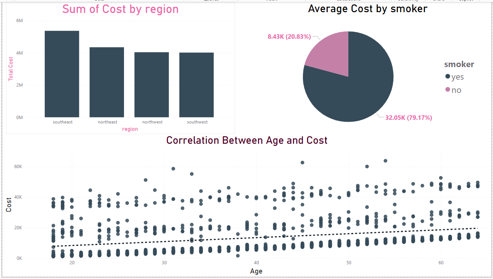

# Insurance Project

## 📌 Overview

This project focuses on **Insurance Data Analysis and Prediction**, analyzing insurance claims data to extract insights and build predictive models to estimate insurance costs. The project covers data cleaning, exploratory data analysis (EDA), and machine learning modeling.

## 📈 Project Workflow

1. **Data Collection:** Import data and understand its structure.
2. **Data Cleaning:** Handle missing values, duplicates, and outliers.
3. **Exploratory Data Analysis (EDA):** Identify trends, patterns, and correlations.
4. **Feature Engineering:** Convert categorical variables and scale numerical features.
5. **Model Training:** Develop machine learning models for cost prediction.

---

## 🔍 Exploratory Data Analysis (EDA)

Key findings from the data analysis include:

- **Smokers** pay **60% higher** insurance charges on average.
- There is a strong correlation between **Age** and **insurance costs**.
- The **Southeast** region has the highest average medical charges.


## 🛠️ Technologies Used

- **Python** (Pandas, NumPy, Scikit-Learn, Matplotlib, Seaborn)
- **SQL** for data manipulation
- **Jupyter Notebook** for analysis and data visualisation
- **Machine Learning models** Linear Regression & Random Forest Regression (Best Model)

## 🏁 Results
- Smokers incur significantly higher insurance costs.
- Age and BMI are strong predictors of medical expenses.
- The Random Forest model performed well in predicting insurance costs.

## 📊 Dataset

The dataset includes policyholder details, claim history, premium amounts, and fraud indicators. The data is preprocessed to handle missing values, outliers, and categorical encoding.
The dataset used for this project is the **Medical Cost Personal Dataset**, available on [Kaggle](https://www.kaggle.com/datasets/mirichoi0218/insurance).

## 🚀 Installation

1. Clone the repository:
   ```sh
   git clone https://github.com/Kaiwang1452/Insurance_Project.git
